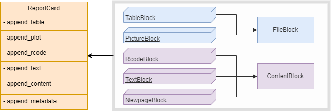

## Overview of Content Blocks
This document serves as a comprehensive guide to the various types of content blocks available in the `teal.reporter`. 
These blocks allow users to structure and customize reports.

## Table: Content Blocks in `teal.reporter`
The following table outlines the different blocks that can be included in a `ReportCard`, 
along with descriptions and usage examples:

| **Block Type** | **Description** | **Usage Example** |
  |----------------|----------------|-------------------|
  | **`ReportCard`** | Combines various content blocks into a single card. | `report_card <- ReportCard$new()` |
  | **`TextBlock`** | Adds text-based content to the report. | `report_card$append_text(<text>)` |
  | **`PictureBlock`** | Contains graphical content like plots or diagrams. | `report_card$append_plot(<plot>)` |
  | **`RcodeBlock`** | Embeds R code directly into the report. | `report_card$append_rcode(<code text>, echo = FALSE)` |
  | **`NewpageBlock`** | Marks a new page in the report for organization purposes. | `report_card$append_content(<ContentBlock e.g NewpageBlock$new()>)` |
  | **`TableBlock`** | Holds and displays tabular data. | `report_card$append_table(<table>)` |
  
 These blocks form the building blocks of a `ReportCard`, each serving a specific function that contributes to the overall layout and content of the report. The `ReportCard` object utilizes `append_*` methods to integrate various blocks such as `TextBlock`, `PictureBlock`, `RcodeBlock`, and `TableBlock`.

The following diagram illustrates the inheritance relationship between the different blocks:
```{r echo=FALSE, out.width='60%'}

```

## Global `knitr` Options
To ensure consistency and control over the rendering of markdown elements within reports, teal.reporter adheres to the following default global knitr options:

To access the default values for the `global_knitr` defaults include:
* echo: displays the code along with its output (`echo = TRUE`).
* tidy: formats the `R` code for readability using the `formatR` package if installed (`tidy = TRUE`), otherwise set to `FALSE`.
* width cutoff: sets the maximum number of characters per line in the code output (`tidy.opts = list(width.cutoff = 60)`).

You can access and modify these settings as follows:
```{r}
library(teal.reporter)
getOption('teal.reporter.global_knitr')
```

## Example Report Using Multiple Content Blocks
Below is a complete example demonstrating how to create a report combining various content blocks:

```{r}

library(ggplot2)

report_card <- ReportCard$new()

report_card$append_text("Header 2 text", "header2")
report_card$append_text("A paragraph of default text")
report_card$append_plot(
 ggplot(airquality, aes(x = Ozone, y = Solar.R)) + geom_line(na.rm = T)
)
report_card$append_table(airquality)
report_card$append_rcode("airquality_new <- airquality", echo = FALSE)
report_card$append_metadata(key = "lm", value = lm(Ozone ~ Solar.R, airquality))
report_card$get_content()

```
